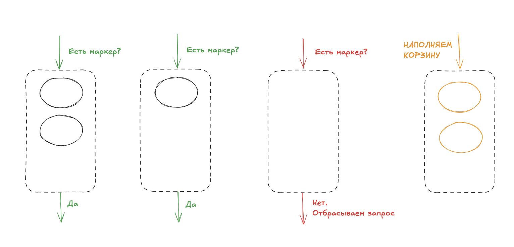
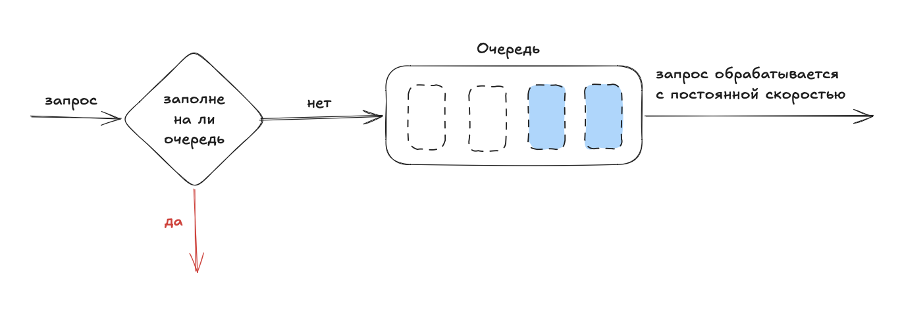
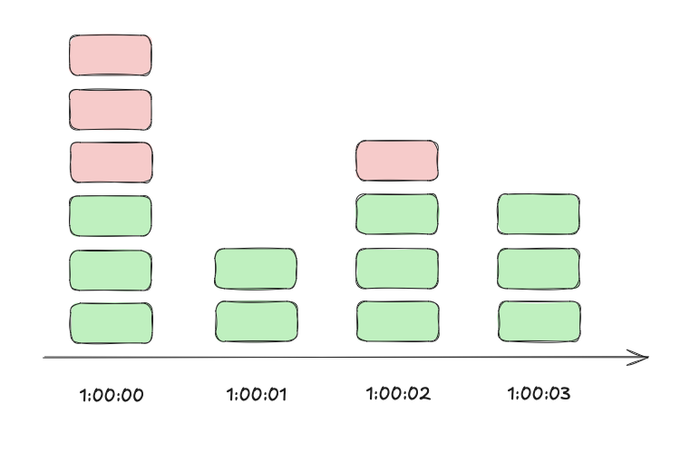
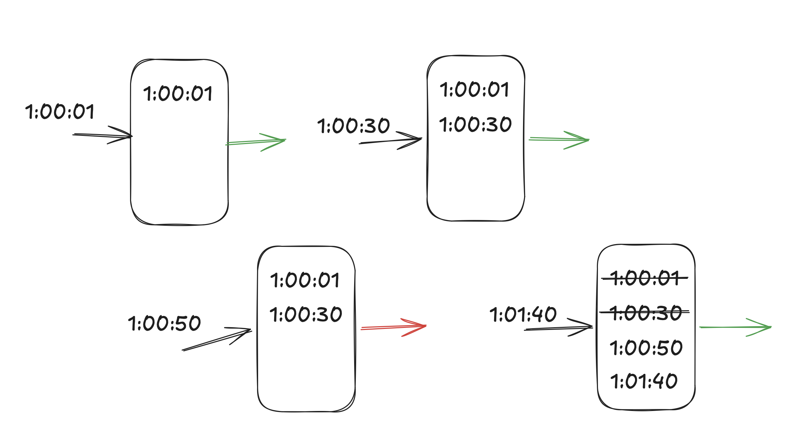
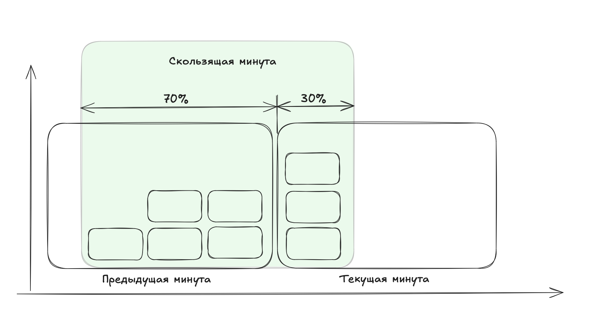

# Ограничитель трафика (Rate limiting)

## Алгоритм маркерной корзины (token bucket)

Это контейнер заранее определенной емкости. В нее регулярно помещают маркеры. Когда корзина наполняется, маркеры больше не добавляются.  

Каждый запрос потребляет один маркер. При поступлении запроса мы проверяем достаточно ли маркеров в корзине. Если маркеров достаточно, то мы удаляем по одному. Если маркеров недостаточно, тогда запрос отклоняется.  

## Алгоритм дырявого ведра (leaking bucket)

При поступлении запрос, алгоритм проверяет, заполнена ли очередь. Запрос добавляется в очередь при наличии места. В противном случае запрос отклоняется. Запросы извлекаются из очереди и обрабатывается через **равные промежутки времени**.

## Счетчик фиксированных интервалов (fixed window counter)

Алгоритм делит заданный период времени на одинаковые интервалы и назначает каждому из них счетчик. Каждый запрос инкрементирует счетчик на 1. Как только счетчик достигает заранее заданного лимита, новые запросы начинают отклоняться, пока не начнется следующий интервал. 

## Журнал скользящих интервалов (sliding window log)

Когда поступает новый запрос, все просроченные запросы отбрасываются. Просроченными считаются запросы раньше начала текущего временного интервала. Врменные метки новых запросов заносятся в журнал. Если количество записей в журнале не превышает допустимое, запрос принимается, если превышает - отклоняется.

## Счетчик скользящих интервалов (sliding window counter)

Гибридный подход, сочетающий в себе два предыдущих алгоритма. 

Условно рассчитывается по формуле: 
запросы на текущем интервале + запросы на предыдущем интервале * процент предыдущего интервала. 

`3 + 5 * 0.7 = 6.5`. Если ограничение выставленно в 7 запросов, то следующий запрос уже не выполняется. 

 
 
   

[>>> Назад <<<](../README.md)