# Архитектуры ИС

## Файл-сервер

Файл-сервер только извлекает данные из файла или БД и передает их клиенту для дальнейшей обработки

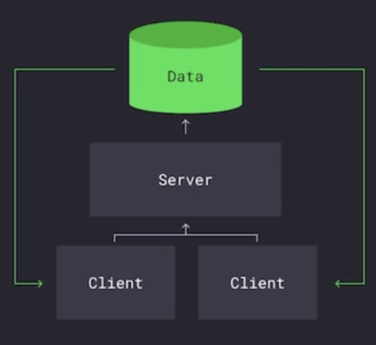

## Клиент-сервер

Извлекает данные из файла/БД и отдает их клиенту 

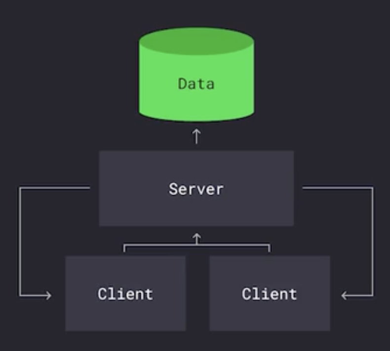

## Peer-to-peer

Все узлы выполняют одинаковые функции

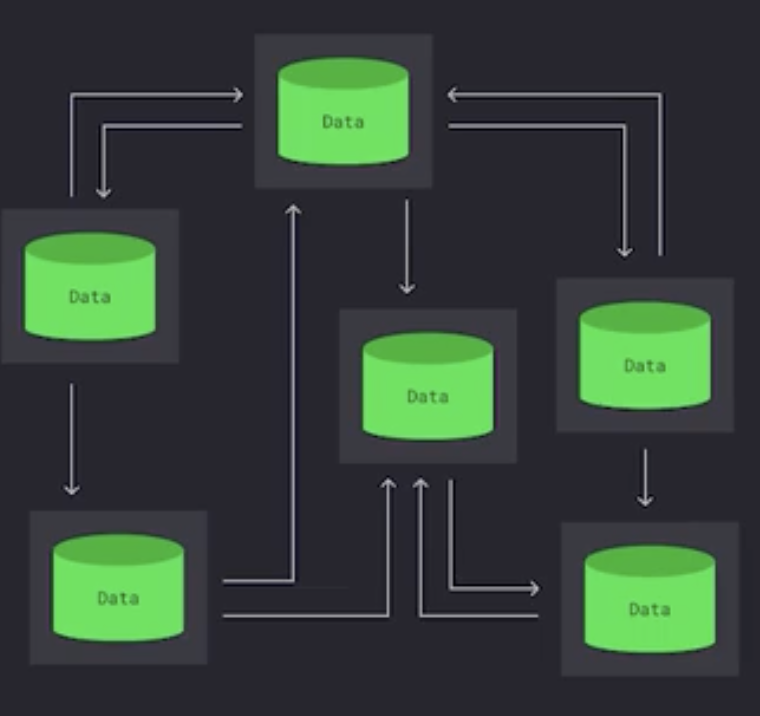

 

# Паттерны 

## Shared Database Antipattern

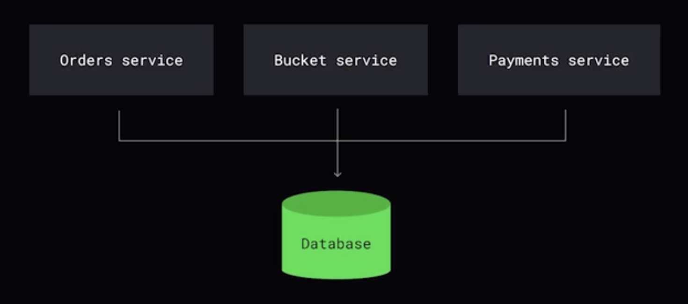

## Database per-service pattern 

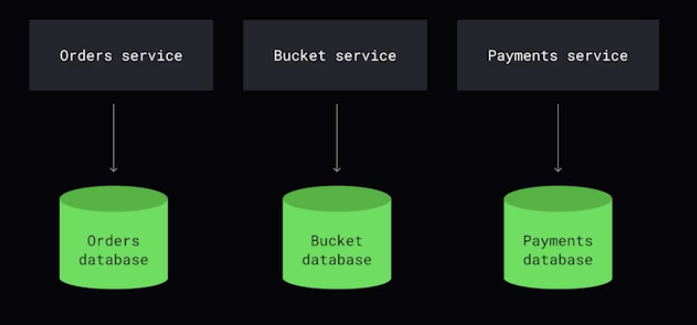

 

# Коммуникации

## Синхронные. Цепочка

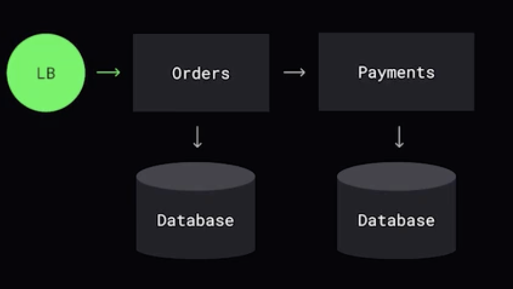

## Синхронные. Агрегатор (Api Composition)

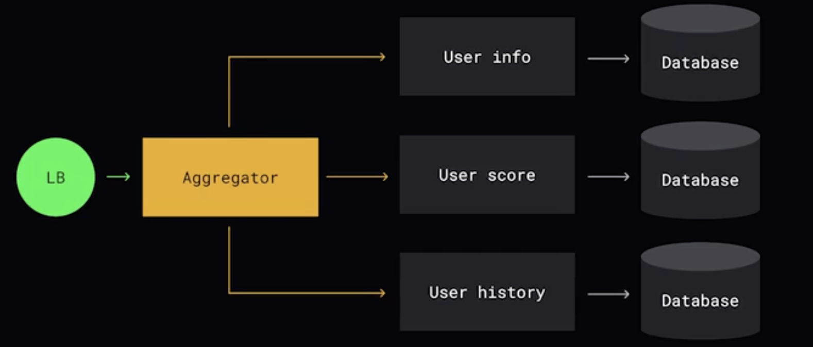

## Асинхронные. Точка-точка. Put/take

Сендер не ждет пока сообщение будет обрботано. **Кто-то один** вычитает сообщение из очереди.

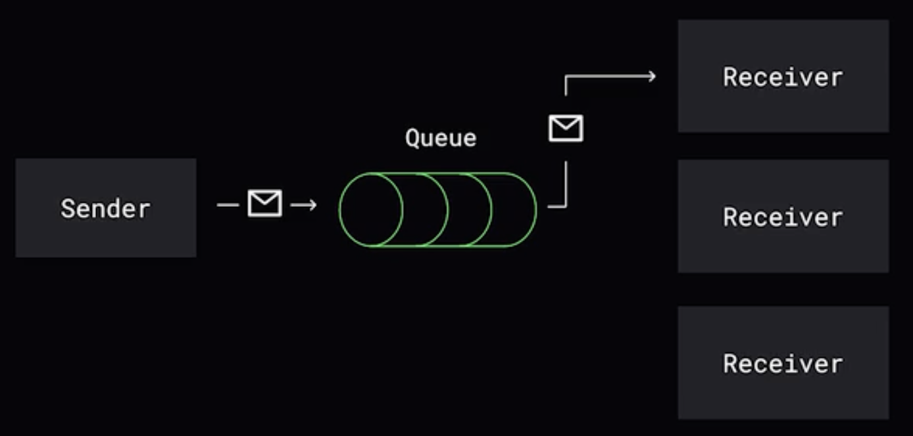

## Асинхронные. Издатель-подписчик. Pub/Sub

**Множество** подписчиков получает одно сообщение.

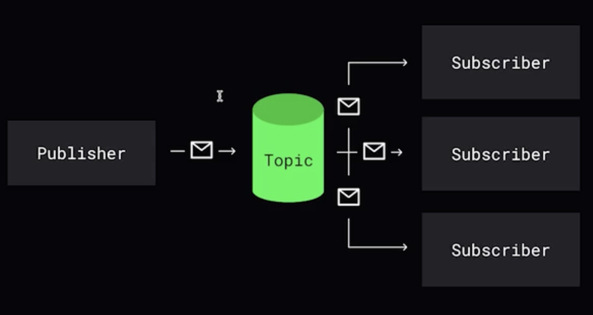

## Асинхронные. Две очереди. Request/response

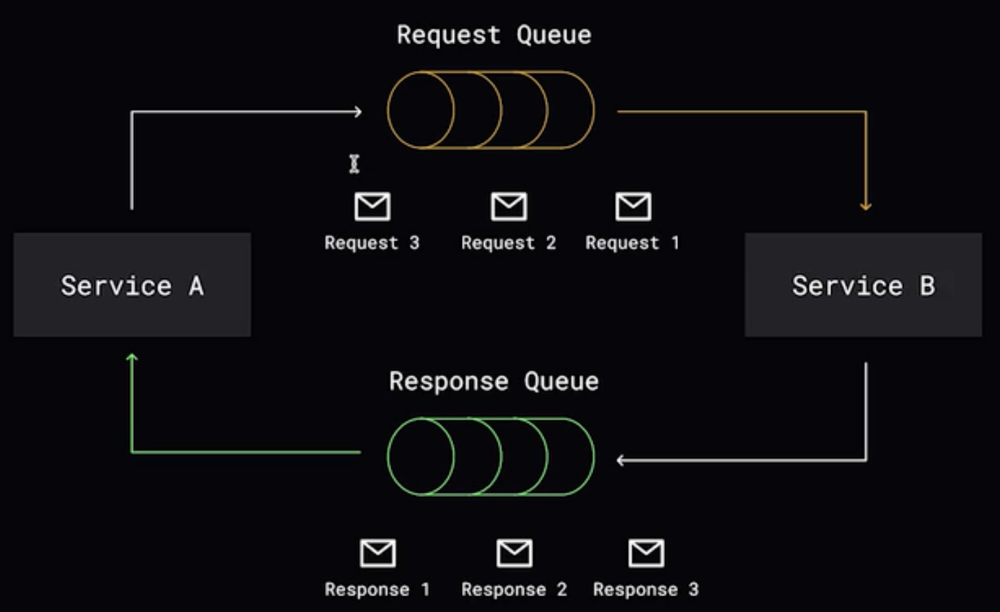

 

# Событийно-ориентированная архитектура

При такой архитектуре используется обычно шина данных - очередь.

1. Event notification

Объект изменился, но прочие детали при личном визите!

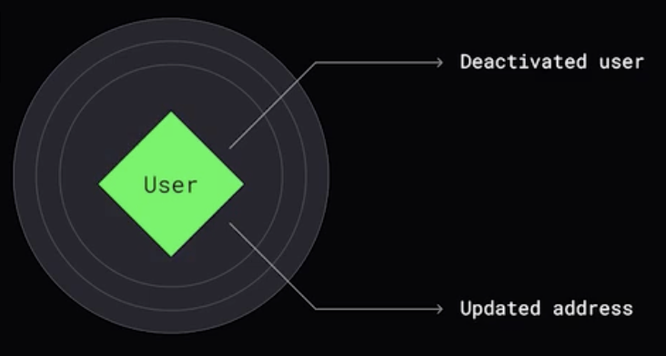

 

2. State transfer

Объект изменился и вместе с этим отправляется обновленная информация

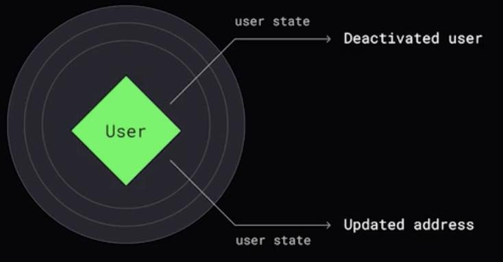

 

# Event sourcing

Не храним финальное состояние, а храним череду событий. По сути - это журнал изменений. Каждое событие небольшая дельта изменений (концепция похожа на git).

Правила: 
1. Не можем удалять события
2. Не можем изменять события

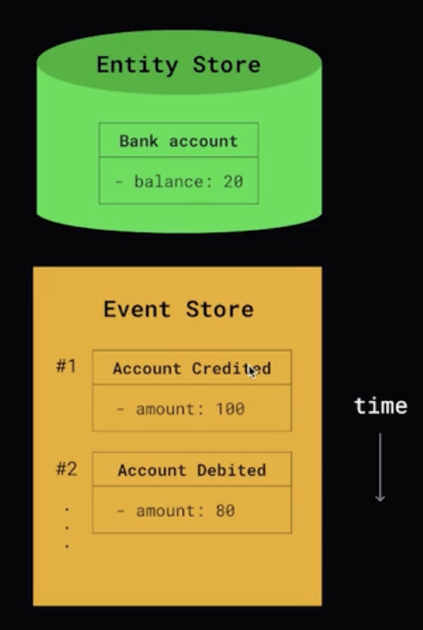

 

# CQRS (Command and Query Responsibility Segregation)

Подход, когда разделяется пайплайн чтения или записи

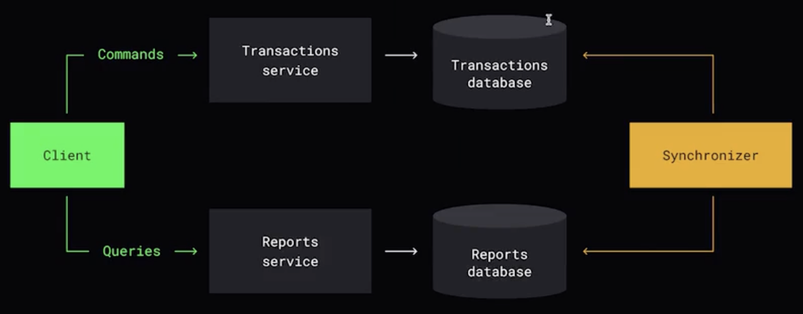

 
 
   

[>>> Назад <<<](../README.md)