# Виды релизов

## Rolling release

Новая версия приложения вводится постепенно. 

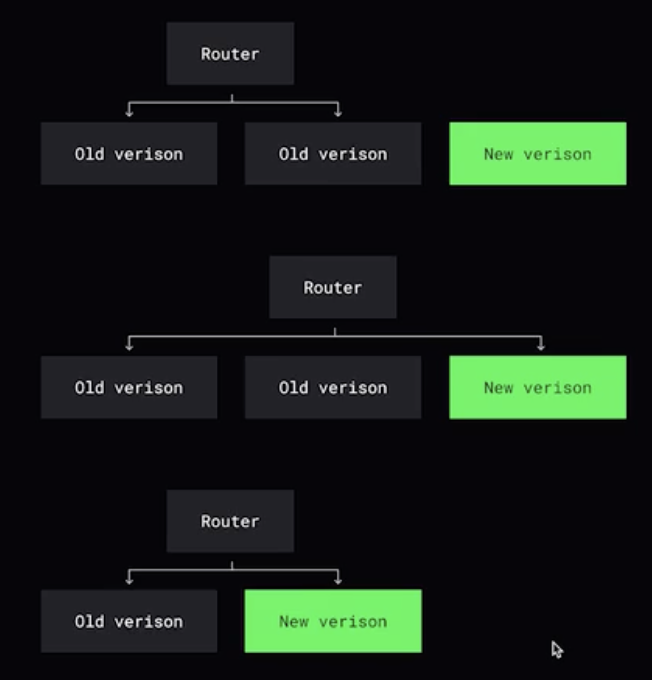

 

## Blue/green release

Blue - старая версия приложения, Green - новая версия приложения. 

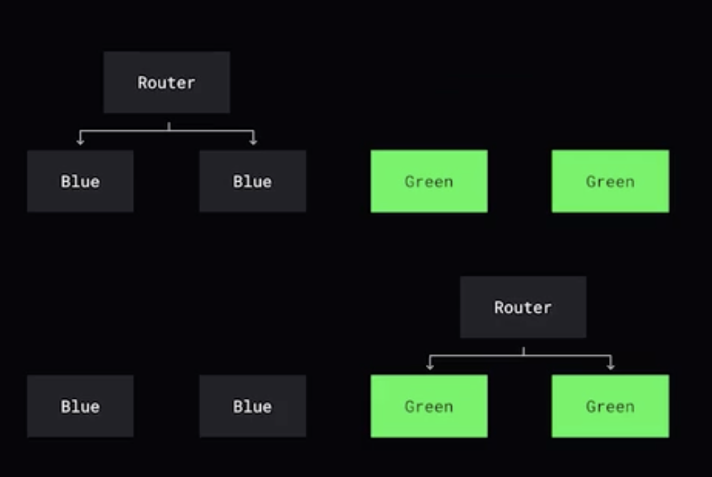

 

## Canary release

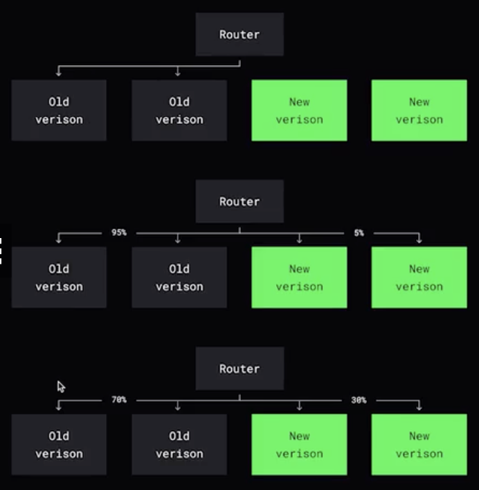

 

# Подходы в проектировании

## Ретраи

Нужно искать компромисс между:
1. Пользовательский запрос обязательно должен быть выполнен
2. Лучше ответить ошибкой, чем перегрузкой сервисов

## Идемпотентность

Свойство объекта или операции (GET, PUT, DELETE) при повторном применении операции к объекту давать такой же результат, что и при первом применении.  

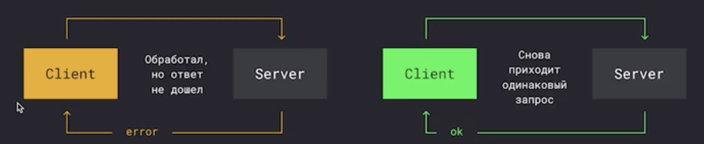

 

## Backoff

Повтор через фиксированный интервал времени и экспонициальное откладываение - каждый раз timeout увеличивается. 

100s -> 200s -> 500s -> x

## Rate limiting 

Подробнее [тут](../_notes/part_11.md)

## Load shedding

В случае инциндента может быть необходимо сбросить часть неприоритетных запросов, чтобы критически важные продолжили выполняться

## Backpressure

Способ при котором принимающая сторона сообщает сервису о том, что он превысил квоты на запросы. 

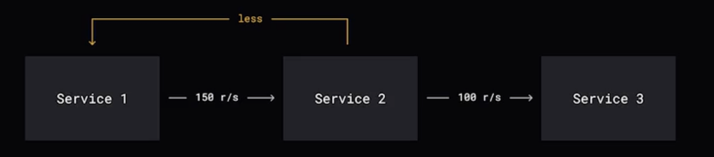

 

## Circuit Breaker

Либо отдельный сервис, либо компонент сервера, который отвечает за то, что если сервер начинает отвечать ошибками, тогда он открывается и не пропускает часть запросов. 

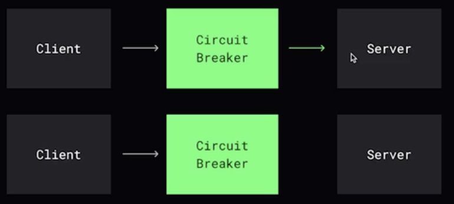

 

## Self-healing

Механизм самовосстановления может восстанавливать работу приложения без посторонней помощи. 

Минус:
- может привести к непрерывному перезапуску приложения, когда из-за перезагрузки или тайм-аута базы данных (прогрев кэша) не может ответить наблюдающей стороне, что оно работает.

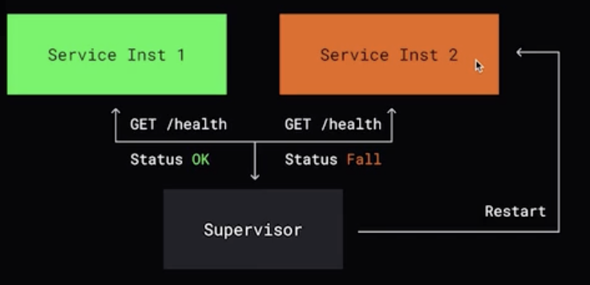

 

## Graceful degradation

Когда в системе вырастает нагрузка, она не должна падать, она должна либо замедлять работу, либо отклонять часть запросов.

Реализуется через feature toogle - метод позволяющий отключать функционал.

## Fallback

Выдача дефолтной страницы, дефолтного сценария при недоступности основного функционала.

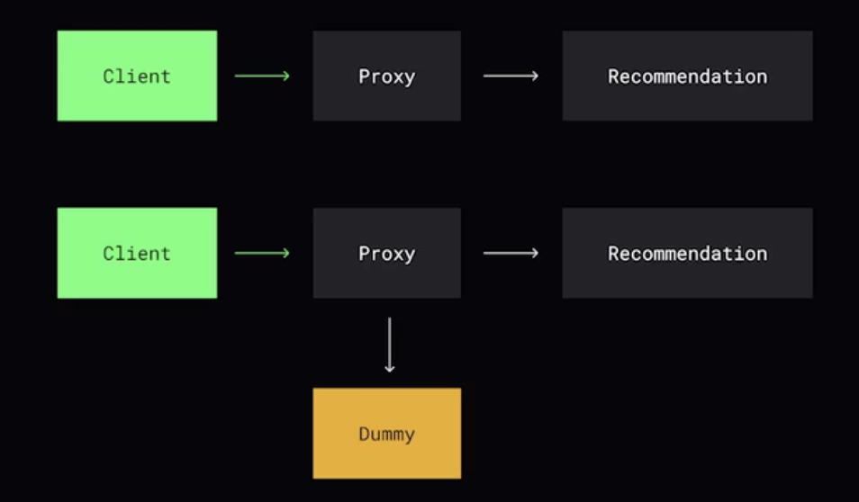

 

## Failover caching

Метод исползования аварийного кэша, который используется в случае отказа критической части системы

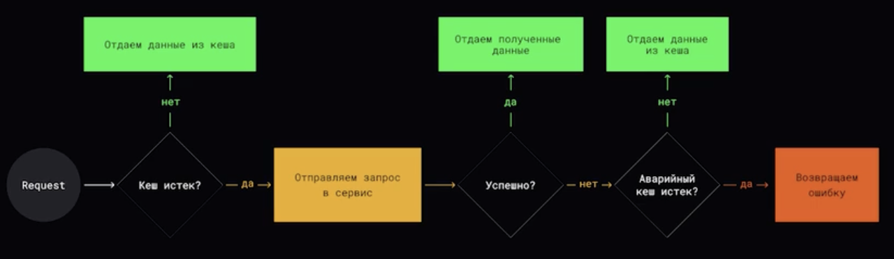

## Dead letter queue

Механизм, который используется для обработки сообщений, которые не могут быть успешно обработаны или доставлены в основной очереди сообщений. 

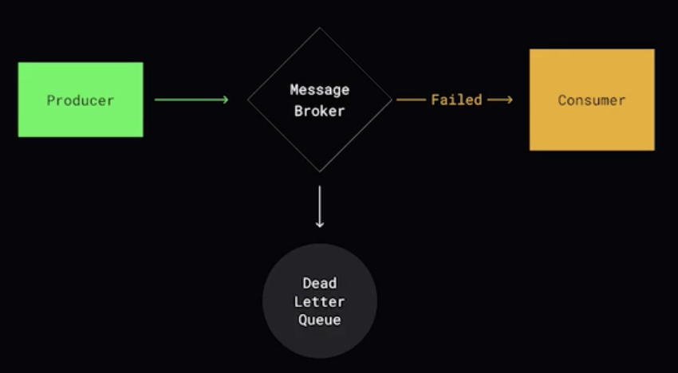

## API Gateway

Механизм, при котором часть функций системы могут быть исполнены до похода в систему, т.о. убирая необходимость производить схожие операции на каждом сервисе:
- application firewall
- rate limits
- authentifacation / autorization
- monitoring
- ssl termination
- retry
- caching

## Throttling / Debouncing

Техники ограничения частоты вызова функций. 

Debouncing - функция начнет выполняться после того, когда события перестали приходить.

Throttling - функция выполняется не чаще N раз в ms/

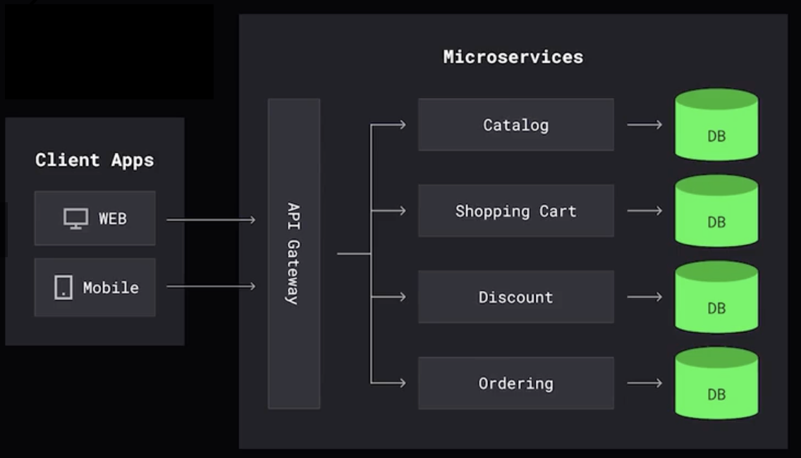

 

# CQRS (Command and Query Responsibility Segregation)

Подход, когда разделяется пайплайн чтения или записи

 
 
   

[>>> Назад <<<](../README.md)