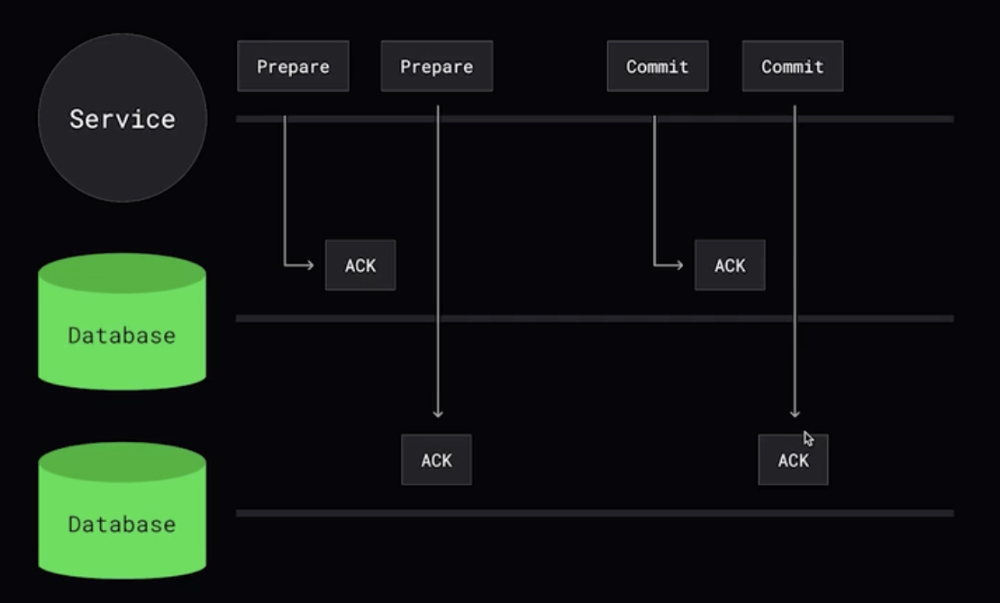
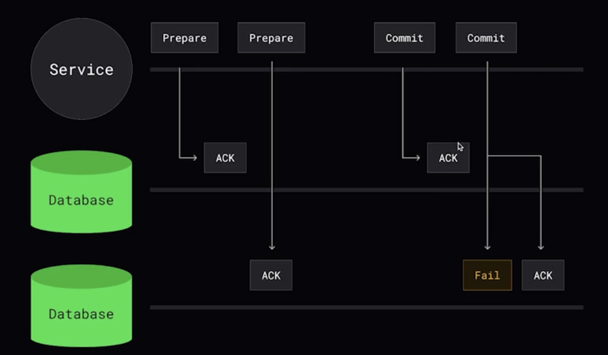
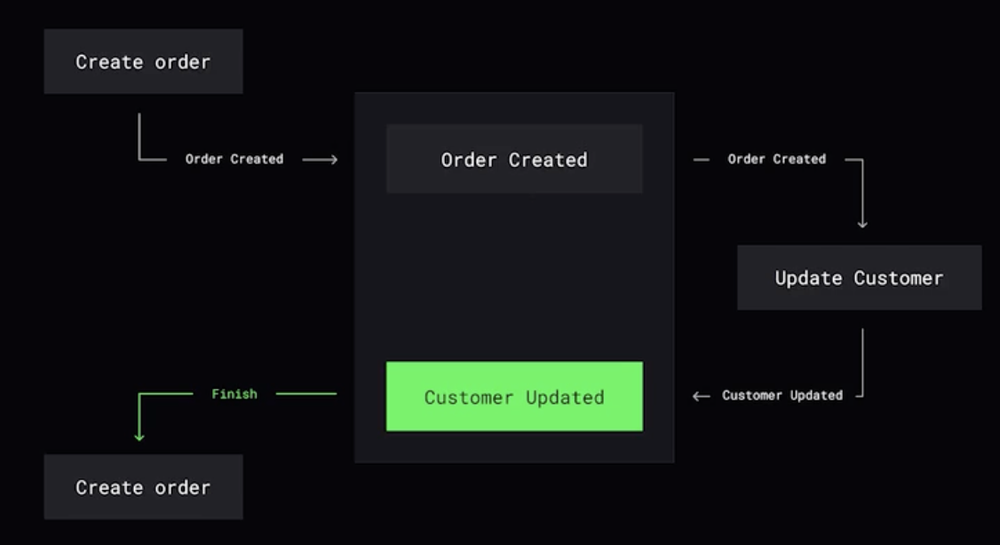
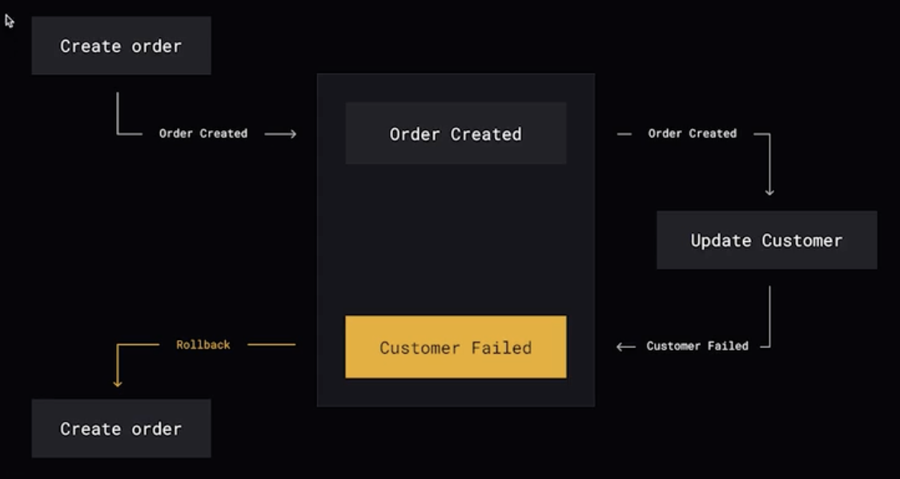
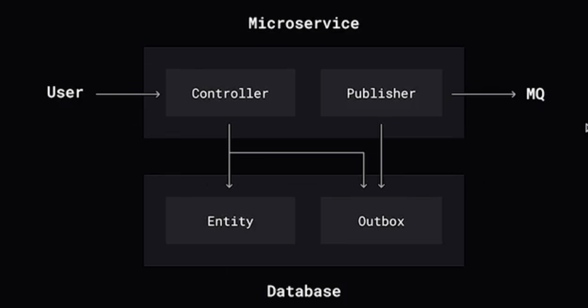
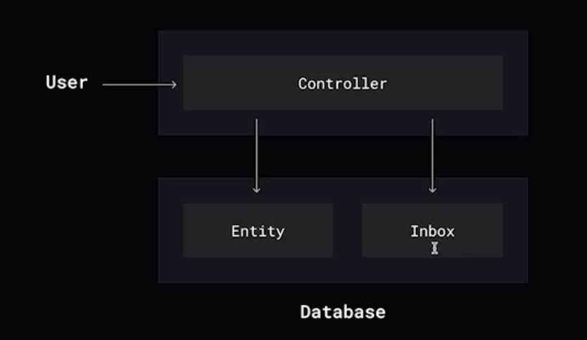
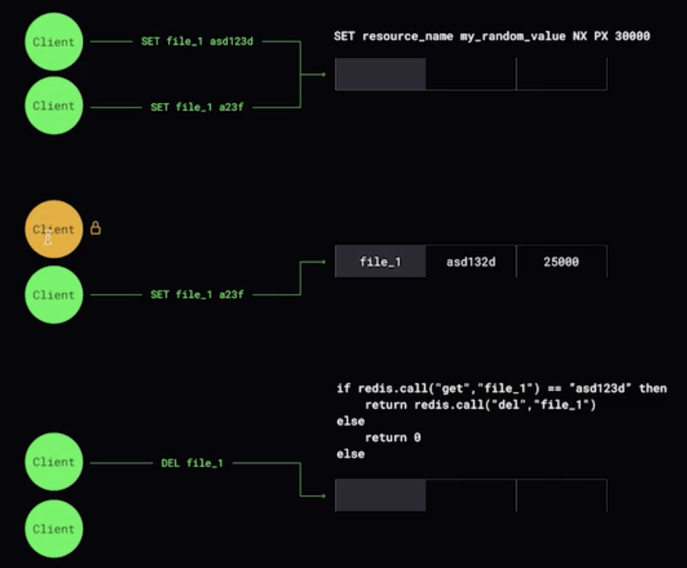
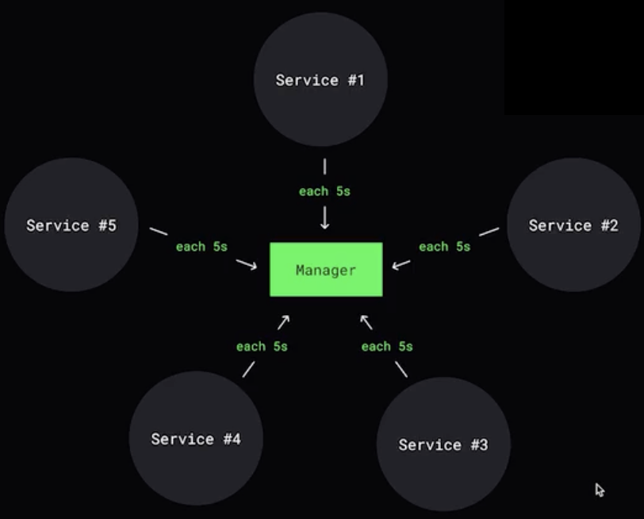
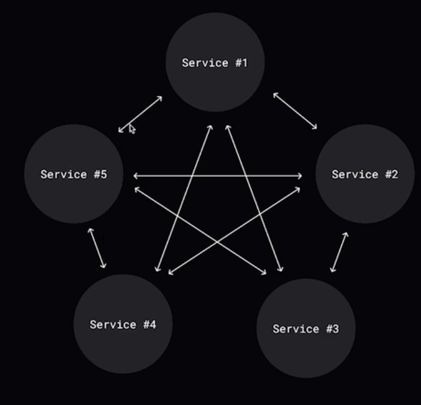

# Консенсус

Это способность узлов согласовать определенные действия между собой.  

Требования протокола консенсуса:
1. **Прекращение (Termination)** - в конце концов, каждый правильный процесс должен выдавать некоторое значение.  

2. **Целостность (Integrity)** - если все правильные процессы предлагают одно и то же значение, то процесс поискать консенсуса также должен выдавать то же значение.

3. **Согласие (Agreement)** - правильный процесс должен согласовывать одно и то же значение.

**Основные алгоритмы консенсуса:**

1. Paxos
2. Raft

## Распределенные транзакции

### Two Phase comnit (2PC)

Две системы должны ответить положительно, тогда коммит произойдет. 

Фаза Prepare - означает, что нужно начать фазу транзакции и выполнить какие-то операции, но не нужно **не коммититься**. После получения подтверждения ACK координатор начинает совершать коммит.

Если на этапе ACK происходит fail, тогда вторая фаза будет полностью отдана под rollback. 

Если в случае коммита второй фазы происходит ошибка, тогда необходимо ретраить до тех пор, пока коммит не произойдет.

### SAGA 

Представляет набор локальных транзакций. 

Каждая локальная транзакция обновляет базу данных и публикует сообщение или событие, инициируя следующую локальную транзакцию. 

В случае fail'a произойдет будет опубликовано **другое сообщение** в топик с ошибками и сервис запустит компенсирующую транзакцию.  

!!! Сага не обеспечивает изолированность транзакции !!!

## Как асинхронно донести данные в несколько мест

### Transactional Outbox

### Transactional Inbox

## Распределенная блокировка

## Как распространять изменения между узлами?

1. Централизованный подход

2. Децентрализованный подход - broadcast  

Отправка сообщения все участникам  

3. Децентрализованный подход - gossip

Отправка сообщения только тем, о ком сервис знает  

## Модели согласованности

1. Linearizability - модель, которая гарантирует, что любая операция чтения вернет самое последнее записанное значение, а вся система ведет себя так, как будто существует только одна копия данных, обновляемая мгновенно. 

2. Eventual Consisstency - модель, гарантирующая, что если в систему не вносятся новые обновления, то через некоторое время все реплики придут к одному и тому же состоянию.

3. RYW (Read Your Own Writes) - модель, гарантирующая, что если клиент обновил данные, то при последующем чтении он сразу увидит эти изменения. Предотвращает исчезновение данных из-за задержки репликации.

4. Monotonic Read - модель, обеспечивающая, что если клиент прочитал значение данных, то все последующие чтения вернут то же самое или более новое значение.  
    Например, комментарии.

5. Causal Consistency - модель, гарантирующа, что операции, связанные причинно следственной связью, видны всем узлам в одинаковом порядке.   
    Например, ответ на комментарий. Их нельзя поменять местами. Цепочка событий важна.
