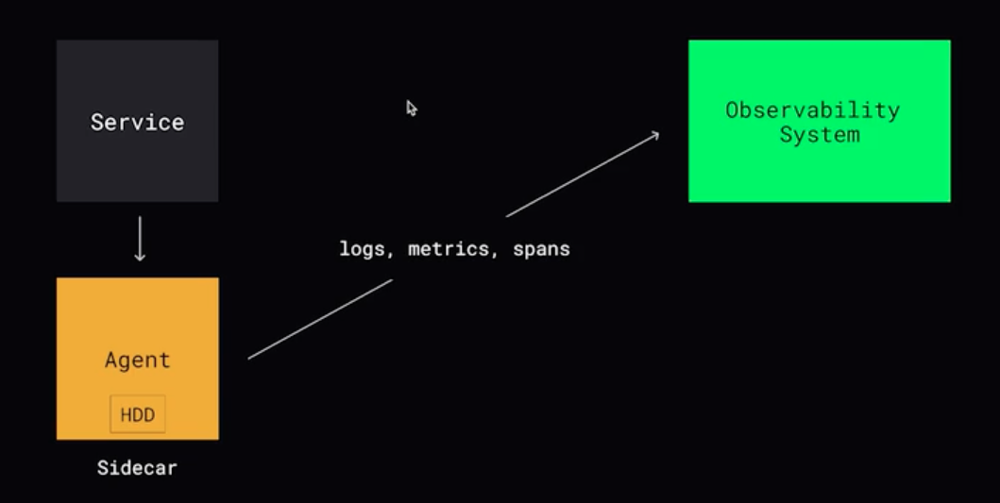

# Observability

## Мониторинг

Процесс сбора, анализа и визуализации данных о работе приложения с целью обеспечения его надежности, производительности и доступности.  

Системы: Prometheus, graphite, zabbix, victoria metrics

### LTES (Google SRE):
- Latency - время на обработку одного запроса
- Traffic - количество запросов
- Errors - количество ошибок
- Saturation - насколько компонент использует свои ресурсы 

### RED
- Rate - количество запросов
- Errors - количество ошибок
- Duration - время обработки одного запроса

### USE
- ulitization - время или процент использования ресурса
- saturation - количество отложенной работы
- errors - количество ошибок

## Алертинг

Алертинг отслеживает изменения определенных метрик с помощью алертов и отправляет уведомления через подходящий для вас канал уведомлений. 

## Логирование

Логирование - запись логов, позволяет понять что происходило, когда и при каких обстоятельствах.

Что логировать:
1. Ошибки и исключения
2. События и действия пользователей
3. Запросы к серверу и сторонним ресурсам
4. Информацию о состоянии приложения

Системы: graylog, ELK

## Трэйсинг

Инструмент для трассировки и анализа оаспределенных запросов, благодаря которому можно определить, где происходят сбои, что вызывает низкую производительность, а также как происходит процесс выполнения конкретных запросов. 

span - операция

Системы: Jaeger, Zipkin, LightStep

## Непрерывное профилирование

Метод анализа и измерения производительности программного обеспечения, который позволяет получать данные о работе программы в режиме реального времени

Системы: Parco, Pyroscope или ... Sentry. 

## SLA, SLO, SLI

Это компоненты управление качеством IT услуг. 

**SLI (Service Layer Indicator)** - *(что измеряем)* - показатель производительности: доступность, время отклика, частота ошибок

**SLO (Service Layer Objective)** - *(к какой цели стремимся)* - внутренняя цель

**SLA (Service Layer Agreement)** - *(что будет, если мы не достигнем цели?)* - договор между провайдером и клиентом, что будет если мы не достигнем SLO

## DORA метрики

DORA метрики - это четыре ключевых показателя, разработанных исследовательским проектом DORA (DevOps Research and Assessment), которые оценивают производительность команд разработки ПО и стабильность их релизов. Они разделены на метрики скорости (_как часто и быстро поставляем_) и стабильность (_как надежно_), помогая находить "узкие места".

Четыре ключевые метрики:
1. Частота развертывания (Deployment Frequency - DF) - как часто код успешно деплоится на продуктив

**Как часто?**

2. Время выполнения изменений (Lead Time for Changes - LT) - время фиксации кода до его развертывания на проде.

**Как быстро?**

3. Частота сбоев при изменениях (Change Failure Rate - CFR) - процент деплоев, приведший в сбоям, инцидентов или требующих срочного исправления.

**Как плохо?**

4. Время восстановления (Mean Time to Restore Service - MTRS) - время, необходимое для восстановления работоспособности сервиса после инциндента на проде.

**Как оперативно?**

Почему важна:

- Оценка DevOps культуры - помогает понять, насколько эффективно команда создает ценность, для клиентов
- Бенчмаркинг - позволяет сравнить команду с лучшими индустриальными стандартами
- Улечшение процессов - показывает, где есть проблемы, позволяя не "красить цифры", а реально улучшать процесс.

 
 
   

[>>> Назад <<<](../README.md)