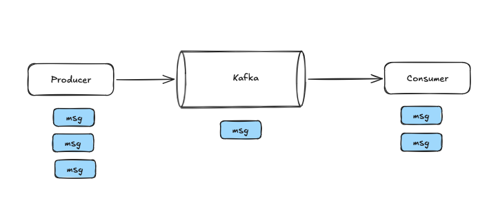
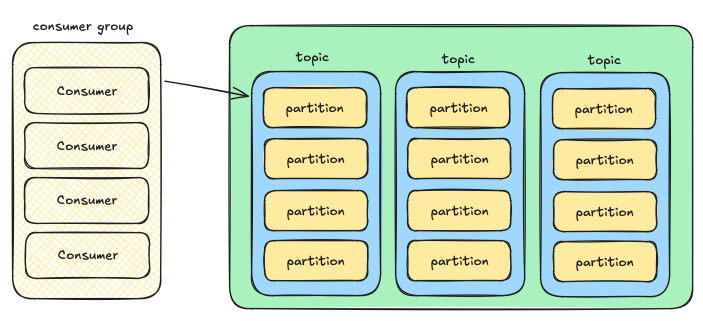
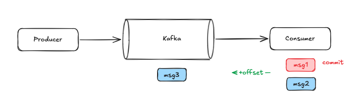
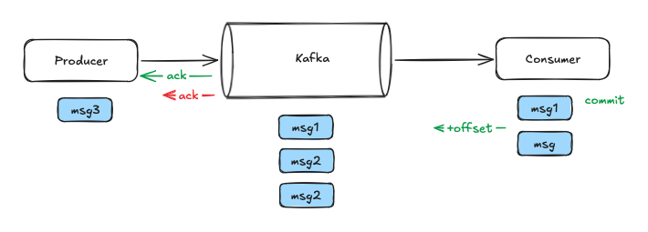

# Брокер сообщений

Примеры: _Kafka_ - pull модель; _RabbitMQ_ - push модель

Плюсы 
1. Асинхронная связь
2. Слабое связывание
3. Масштабируемость
4. Отказоустойчивость
5. Понимание потоков данных

**Kafka** - Очередь сообщений, необходимая для асинхронной передачи данных. 

## Почему kafka?

Промышленная стримминговая платформа для высоких нагрузок:
- миллиарды сообщений в секунду
- хорошо масштабируется горизонтально из коробки
- идемпотентность

Pub/Sub - тупой брокер, умный консьюмер - kafka не знает кто и что читает. Всю логику реализует приложение, а Kafka просто хранит данные.

По сути это **распределенная БД**. Сообщения там храняться на диске. 

## Топики и партиции

Топики разбиты по партициям. Для каждой партиции может быть свой консьюмер. 

## Консьюмер группа

**Консьюмер группа** - это объединение нескольких консьюмеров, работающих совместно для чтения данных из топика. Консьюмер группа легко расширяется и автоматически мапится на партиции. Нужно правильно выбирать ключ партиционирования для локальной упорядоченности (в рамках одной партиции). 

Преимущества:
- масштабирование - добавление новых консьюмеров с одинаковым *group.id* позволяет обрабатывать данные параллельно
- отказоустойчивость - если один потребитель выходит из строя, его партиции автоматически перераспределяются между оставшимися участниками.
- идентификация - группа индентифицируется уникальной строкой *group.id*

## Гарантирован ли порядок сообщений в кафке?

Гарантирован в рамках одной партиции. необходимо выбирать ключ так, чтобы распределение по партициям было равномерно.

## Гарантии доставки

1. **At most once**

Настройка по умолчанию.

Сообщение доставим **максимум один** раз. Сообщения могут быть потеряны из-за того, что консьюмер коммитит сообщения, полученные от kafka. Если сообщение получено, но потеряно, всё равно оно будет закомиченно.

2. **At least once**

Сообщение доставим **по крайней мере** один раз. Могут быть дубли из-за того, что producer не смог обработать ack от kafka. 

Как из at most once сделать at least once:
- у продссера включить **ретраи** и **ack'и**
- у консьюмера фиксировать офсет только после успещной обработки сообщения. если упали, то перечитываем сообщение

3. **Exactly once**

Тот же at least once, но с избавлением от дублей. 

На уровне продюсера:
- добавить ack'и
- добавить ретраи
- добавить **ключ идемпотентности**

На уровне косьюмера:
- управление offset'ом на косьюмере (за пределами кафки)
- фиксировать результаты обработки сообщения и в offset в одной транзакции (transactional inbox)
- использовать offset из своего хранилища при повторном подключении к кафке
