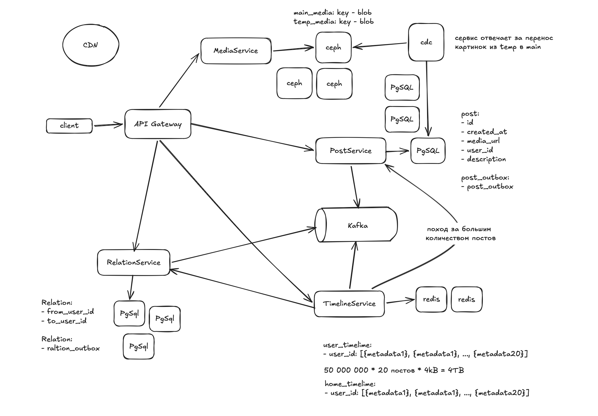

# VK Feed

**Функциональные требования:**
- посты с текстами и картинками
- добавление и удаление друзей 
- просмотр домашней ленты и ленты пользователей
- посты отображаем в обратном хронологическом порядке

**Нефункциональные требования:**
- DAU 50 млн
- Availability 99.95%
- Посты храним всегда 
- Максимальное количество друзей 1 млн
- Среднее кол-во друзей
- Количество символов в посте - 2000
- Максимальное кол-во картинок в посте - 1
- В среднем 1 пост в 5 дней 
- Ленту пользователь просматривает 10 раз/день
- Аудитория из СНГ
- Сезонности нет
- Тайминг:
    - выдача постов - до 2с
    - создание поста - 1с
    - добавление/удаление друзей - 0.5с
    - пользователь увидит пост друга с небольшой задержкой

**Нагрузка:**
20% требований - 80% нагрузки: просмотр лент

RPS (write): 50 000 000 / 5 / 86400 = 115
RPS (read): 50 000 000 * 10 / 86400 = 5.8k

read intensive

**Трафик:**
(write media): 115 * 1MB (1 картинка) = 115MB/s
(write meta info): 115 * 4KB (текст) = 460KB/s

(read media): 5800 * 10 постов * 1MB = 58 GB/s
(read meta): 5800 * 10 постов * 4kB = 232 MB/s

**API:**
- ListPost (params, type)
- GetPost (params)

- AddFriend(params)
- DeleteFriend(params)

- UploadMedia(params)
- CreatePost(params)

## Design

Схема:
<src src="../_schemas/schema.excalidraw">